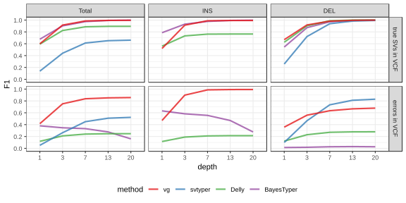
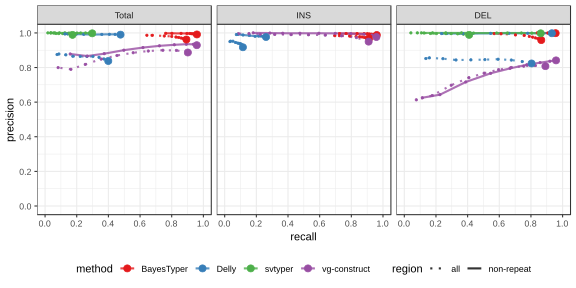
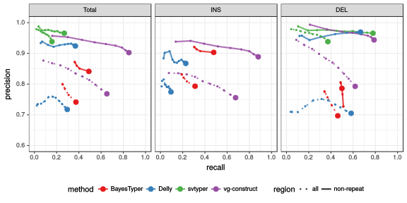
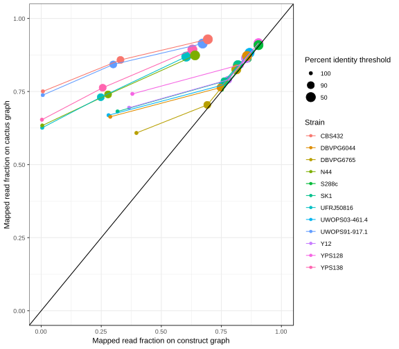

## Results

### Structural variation in vg

In addition to SNV and short indels, vg can handle large deletions and insertions (and inversion?) (Figure {@fig:cartoon}).
As a proof-of-concept we simulated genomes and SVs of varying sizes.
Some errors were added at the breakpoints to investigate their effect on genotyping.
In all simulations, vg performed better than SVtyper[@tag:svtyper] and Delly[@tag:delly] (Figure {@fig:sim}).
The recall was particularly higher than other methods at low sequencing depth.
vg was also more robust to errors around the breakpoints, performing almost as well as in the absence of errors.

{#fig:cartoon}

{#fig:sim width=80%}

### HGSVC

Chaisson et al.[@tag:hgsvc] provide a high-quality SV catalog of three samples, obtained using a consensus from different sequencing, phasing and variant caling technologies. 

#### (Whole-genome) Simulation

The phasing information in the HGSVC VCF was used to extract two haplotypes for sample HG00514, and 30X pairend-end reads were simulated using vg sim.  The reads were used to call VCFs then compared back to the original HGSVC calls (Figure {@fig:hgsvc-sim} and Table {@tbl:hgsvc-sim}).

When restricting the comparisons to regions not identified as tandem repeats or segmental duplications in the Genome Browser (Table {@tbl:hgsvc-sim-nonrepeat}).

{#fig:hgsvc-sim width=80%}

{#fig:hgsvc-real width=80%}

#### (Whole-genome) Real reads

Figure {@fig:hgsvc-real}. 
Tables {@tbl:hgsvc-real} and {@tbl:hgsvc-real-nonrepeat} for results over the genome or when restricting the comparisons to regions not identified as tandem repeats or segmental duplications in the Genome Browser.

 
### Genotyping SV using vg and de novo assemblies

We investigated whether genome graphs derived from genome-genome alignments yield advantages for SV genotyping.
To this end, we analyzed public sequencing datasets for 12 yeast strains from two clades (S. cerevisiae and S. paradoxus) [@doi:10.1038/ng.3847].
From these datasets, we generated two different types of genome graphs.
The first graph type (in the following called *construct graph*) was created from a linear reference genome of the S.c. S288C strain and a set of SVs relative to this reference strain in VCF format.
We compiled the SV set using the output of three methods for SV detection from genome assemblies: Assemblytics [@doi:10.1093/bioinformatics/btw369], AsmVar [@doi:10.1186/s13742-015-0103-4] and paftools [@doi:10.1093/bioinformatics/bty191].
All three methods were run to detect SVs between the reference strain S.c. S288C and each of the other 11 strains.
Merging the results from the three methods and the 11 strains provided us with a high-sensitivity set of SVs occuring in the two yeast clades.
We used this set to construct the *construct graph*.
The second graph (in the following called *cactus graph*) was derived from a multiple genome alignment of all 12 strains using our Cactus tool [@doi:10.1101/gr.123356.111].
While the *construct graph* is still mainly linear and highly dependent on the reference genome, the cactus graph is completely unbiased in that regard.

{#fig:mapping-qual-comp width=80%}

{#fig:mapping-id-comp width=80%}

In a first step, we tested our hypothesis that the *cactus graph* has higher mappability due to its better representation of sequence diversity among the yeast strains.
When mapping short Illumina reads from the 12 strains to both graphs, we indeed observed a higher fraction of reads mapped to the *cactus graph* than to the *construct graph* (see Fig. @fig:mapping-qual-comp).
Only for the reference strain S.c. S288C, both graphs exhibited similar mappability.
This suggests that not the higher sequence content in the *cactus graph*  alone (XX Mb compared to XX Mb in the *construct graph*) drives the improvement in mappability.
Instead, our measurements suggest that genetic distance to the reference strain increases the advantage of the *cactus graph* over the *construct graph*.
Consequently. the gap is largest for strains in the S. paradoxus clade and smaller for reads from strains in the S. cerevisiae clade.

{#fig:geno-comp-recall width=80%}

{#fig:geno-comp-precision width=80%}

Next, we compared the SV genotype performance of both graphs.
To facilitate a fair evaluation of genotype performance, we combined all SVs that were detected by at least two of the three SV callers (Assemblytics, AsmVar and paftools) into a truth set.
This truth set is a subset of the SV set used for construction of the *construct graph* which is important because only variants already present in the graph can be genotyped.

Figure {@fig:geno-comp-recall} and {@fig:geno-comp-precision} shows the results of our analysis. Depending on the clade, the *cactus graph* reaches either a substantially higher SV genotyping recall than the *construct graph* (S. paradoxus) or a substantially lower recall (S. cerevisiae).

