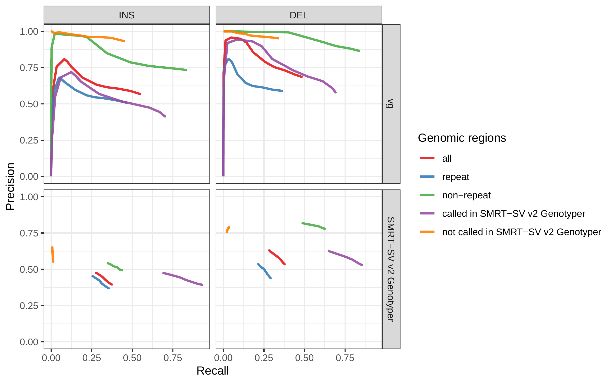

## Supplementary Material {.page_break_before}

### Supplementary Tables

| Experiment      | Method     | Type | Precision     | Recall        | F1            |
|:----------------|:-----------|:-----|:--------------|:--------------|:--------------|
| Simulated reads | vg         | INS  | 0.795 (0.885) | 0.796 (0.883) | 0.795 (0.884) |
|                 |            | DEL  | 0.869 (0.971) | 0.771 (0.92)  | 0.817 (0.945) |
|                 | BayesTyper | INS  | 0.91 (0.935)  | 0.835 (0.9)   | 0.871 (0.917) |
|                 |            | DEL  | 0.898 (0.981) | 0.806 (0.929) | 0.849 (0.954) |
|                 | SVTyper    | DEL  | 0.809 (0.876) | 0.328 (0.754) | 0.467 (0.81)  |
|                 | Delly      | INS  | 0.767 (0.866) | 0.093 (0.225) | 0.166 (0.358) |
|                 |            | DEL  | 0.696 (0.903) | 0.707 (0.846) | 0.701 (0.874) |
| Real reads      | vg         | INS  | 0.431 (0.683) | 0.541 (0.726) | 0.48 (0.704)  |
|                 |            | DEL  | 0.65 (0.886)  | 0.519 (0.708) | 0.577 (0.787) |
|                 | BayesTyper | INS  | 0.601 (0.747) | 0.254 (0.433) | 0.357 (0.549) |
|                 |            | DEL  | 0.627 (0.91)  | 0.325 (0.381) | 0.428 (0.537) |
|                 | SVTyper    | DEL  | 0.661 (0.733) | 0.236 (0.551) | 0.348 (0.629) |
|                 | Delly      | INS  | 0.516 (0.621) | 0.068 (0.176) | 0.12 (0.275)  |
|                 |            | DEL  | 0.55 (0.838)  | 0.445 (0.547) | 0.492 (0.662) |

Table: Genotyping evaluation on the HGSVC dataset. 
Precision, recall and F1 score for the call set with the best F1 score.
The best F1 scores were achieved with no filtering in the vast majority of cases (see Figure {@fig:hgsvc-sim-geno} and {@fig:hgsvc-real-geno}).
The numbers in parentheses corresponds to the results in non-repeat regions. 
{#tbl:hgsvc tag="S1"}

---

| Method     | Type | Precision     | Recall        | F1            |
|:-----------|:-----|:--------------|:--------------|:--------------|
| vg         | INS  | 0.658 (0.774) | 0.646 (0.735) | 0.652 (0.754) |
|            | DEL  | 0.68 (0.768)  | 0.643 (0.735) | 0.661 (0.751) |
| BayesTyper | INS  | 0.776 (0.879) | 0.286 (0.379) | 0.418 (0.53)  |
|            | DEL  | 0.808 (0.886) | 0.512 (0.696) | 0.627 (0.779) |
| SVTyper    | DEL  | 0.742 (0.818) | 0.342 (0.496) | 0.468 (0.618) |
| Delly      | INS  | 0.822 (0.894) | 0.177 (0.268) | 0.291 (0.412) |
|            | DEL  | 0.722 (0.822) | 0.645 (0.768) | 0.681 (0.794) |

Table: Genotyping evaluation on the Genome in a Bottle dataset. 
Precision, recall and F1 score for the call set with the best F1 score. 
The best F1 scores were achieved with no filtering in the vast majority of cases (see Figure {@fig:giab-geno}).
The numbers in parentheses corresponds to the results in non-repeat regions. {#tbl:giab tag="S2"}

---

| Method   | Region     | Type | Precision | Recall |    F1 |
|:---------|:-----------|:-----|----------:|-------:|------:|
| vg       | all        | INS  |     0.665 |  0.661 | 0.663 |
|          |            | DEL  |     0.688 |  0.500 | 0.579 |
|          | non-repeat | INS  |     0.806 |  0.784 | 0.795 |
|          |            | DEL  |     0.869 |  0.762 | 0.812 |
| SMRT-SV  | all        | INS  |     0.757 |  0.536 | 0.628 |
|          |            | DEL  |     0.848 |  0.630 | 0.723 |
|          | non-repeat | INS  |     0.880 |  0.680 | 0.767 |
|          |            | DEL  |     0.971 |  0.824 | 0.891 |

Table: Genotyping evaluation on the pseudo-diploid genome built from CHM cell lines in Audano et al.[@tag:audano2019]. {#tbl:chmpd tag="S3"}

---

| Method   | Region     | Type |    TP |    FP |    FN | Precision | Recall |    F1 |
|:---------|:-----------|:-----|------:|------:|------:|----------:|-------:|------:|
| vg       | all        | INS  | 25838 | 22042 | 15772 |     0.540 |  0.621 | 0.577 |
|          |            | DEL  | 14545 |  6824 | 15425 |     0.681 |  0.485 | 0.567 |
|          |            | INV  |    27 |    26 |   173 |     0.509 |  0.135 | 0.213 |
|          | non-repeat | INS  |  8051 |  3258 |  1817 |     0.712 |  0.816 | 0.760 |
|          |            | DEL  |  3769 |   623 |   818 |     0.858 |  0.822 | 0.840 |
|          |            | INV  |    19 |    12 |    75 |     0.613 |  0.202 | 0.304 |
| SMRT-SV  | all        | INS  | 16270 | 26031 | 25340 |     0.385 |  0.391 | 0.388 |
|          |            | DEL  | 11793 | 10106 | 18177 |     0.539 |  0.393 | 0.455 |
|          | non-repeat | INS  |  4483 |  4659 |  5385 |     0.490 |  0.454 | 0.472 |
|          |            | DEL  |  2928 |   930 |  1659 |     0.759 |  0.638 | 0.693 |

Table: Calling evaluation on the SVPOP dataset. 
Combined results for the HG00514, HG00733 and NA19240 individuals, 3 of the 15 individuals used to generate the high-quality SV catalog in Audano et al.[@tag:audano2019]. {#tbl:svpop tag="S4"}

---

| Method   | Region                | Type |   TP |   FP |   FN | Precision | Recall |    F1 |
|:---------|:----------------------|:-----|-----:|-----:|-----:|----------:|-------:|------:|
| vg       | all                   | INS  | 8618 | 7237 | 5416 |     0.546 |  0.614 | 0.578 |
|          |                       | DEL  | 4762 | 2048 | 5145 |     0.696 |  0.481 | 0.569 |
|          |                       | INV  |   11 |    8 |   54 |     0.579 |  0.169 | 0.262 |
|          | repeat                | INS  | 6176 | 6923 | 4678 |     0.475 |  0.569 | 0.518 |
|          |                       | DEL  | 2428 | 1701 | 4542 |     0.584 |  0.348 | 0.436 |
|          |                       | INV  |    1 |    1 |    6 |     0.500 |  0.143 | 0.222 |
|          | non-repeat            | INS  | 2677 |  987 |  514 |     0.731 |  0.839 | 0.781 |
|          |                       | DEL  | 1180 |  176 |  321 |     0.869 |  0.786 | 0.825 |
|          |                       | INV  |    7 |    4 |   20 |     0.636 |  0.259 | 0.368 |
|          | called in SMRT-SV     | INS  | 3410 | 3789 | 2108 |     0.478 |  0.618 | 0.539 |
|          |                       | DEL  | 2544 | 1092 | 1518 |     0.699 |  0.626 | 0.661 |
|          |                       | INV  |    8 |    8 |   52 |     0.500 |  0.133 | 0.210 |
|          | not called in SMRT-SV | INS  | 4838 |  542 | 3678 |     0.899 |  0.568 | 0.696 |
|          |                       | DEL  | 2034 |   26 | 3723 |     0.987 |  0.353 | 0.520 |
| SMRT-SV  | all                   | INS  | 5245 | 8563 | 8789 |     0.394 |  0.374 | 0.384 |
|          |                       | DEL  | 3741 | 3382 | 6166 |     0.533 |  0.378 | 0.442 |
|          | repeat                | INS  | 3848 | 7125 | 7006 |     0.368 |  0.354 | 0.361 |
|          |                       | DEL  | 1990 | 2832 | 4980 |     0.426 |  0.286 | 0.342 |
|          | non-repeat            | INS  | 1396 | 1468 | 1795 |     0.493 |  0.438 | 0.464 |
|          |                       | DEL  |  901 |  308 |  600 |     0.745 |  0.600 | 0.665 |
|          | called in SMRT-SV     | INS  | 4343 | 5595 | 1175 |     0.445 |  0.787 | 0.569 |
|          |                       | DEL  | 3227 | 2451 |  835 |     0.573 |  0.794 | 0.666 |
|          | not called in SMRT-SV | INS  |  116 |  109 | 8400 |     0.551 |  0.014 | 0.026 |
|          |                       | DEL  |  206 |   16 | 5551 |     0.911 |  0.036 | 0.069 |

Table: Calling evaluation on the SVPOP dataset in different sets of regions for the HG5014 individual. {#tbl:svpop-regions tag="S5"}

---

| SV type | Error type   | Breakpoint | Variant | Proportion | Mean size (bp) | Mean error (bp) |
|:--------|:-------------|:-----------|--------:|-----------:|---------------:|----------------:|
| DEL     | one end      | incorrect  |     220 |      0.219 |        422.655 |           6.095 |
|         |              | fine-tuned |     784 |      0.781 |        670.518 |           5.430 |
|         | both ends    | incorrect  |     811 |      0.814 |        826.070 |           6.275 |
|         |              | fine-tuned |     185 |      0.186 |        586.676 |           2.232 |
| INS     | location/seq | incorrect  |     123 |      0.062 |        428.724 |           6.667 |
|         |              | fine-tuned |    1877 |      0.938 |        440.043 |           6.439 |
| INV     | one end      | incorrect  |     868 |      0.835 |        762.673 |           5.161 |
|         |              | fine-tuned |     172 |      0.165 |        130.244 |           5.884 |
|         | both ends    | incorrect  |     950 |      0.992 |        556.274 |           5.624 |
|         |              | fine-tuned |       8 |      0.008 |        200.000 |           1.375 |

Table: Breakpoint fine-tuning using graph augmentation from the read alignment. 
For deletions and inversions, either one or both breakpoints were shifted to introduce errors in the input VCF. 
For insertions, the insertion location and sequence contained errors.
In all cases, the errors affected 1-10 bp.
{#tbl:simerror-bkpt tag="S6"}

### Supplementary Figures

{#fig:hgsvc-sim-geno tag="S1"}

{#fig:hgsvc-sim tag="S2"}

{#fig:hgsvc-real-geno tag="S3"}

{#fig:hgsvc-real tag="S4"}

{#fig:giab-geno tag="S5"}

{#fig:giab tag="S6"}

![**Genotyping evaluation on the CHM pseudo-diploid dataset.** 
The pseudo-diploid genome was built from CHM cell lines and used to train SMRT-SV v2 in Audano et al.[@tag:audano2019]
The bottom panel zooms on the part highlighted by a dotted rectangle.
](images/chmpd-geno.png){#fig:chmpd-geno tag="S7"}

![**Calling evaluation on the CHM pseudo-diploid dataset.** The pseudo-diploid genome was built from CHM cell lines and used to train SMRT-SV v2 in Audano et al.[@tag:audano2019]](images/chmpd.png){#fig:chmpd tag="S8"}

{#fig:svpop tag="S9"}

{#fig:svpop-regions tag="S10"}

{#fig:simerror-bkpt tag="S11"}

{#fig:panel3 tag="S12"}

{#fig:panel5 tag="S13"}

![**SV genotyping comparison on graphs of all 12 strains.**
Short reads from all 11 non-reference yeast strains were used to genotype SVs contained in both graphs. Subsequently, sample graphs were generated from the resulting SV callsets. The short reads were again aligned to the sample graphs and the quality of the alignments was used to ascertain genotyping performance.
a) Average mapping quality of short reads aligned to the sample graphs derived from *cactus graph* (y-axis) and *VCF graph* (x-axis).
b) Average mapping identity of short reads aligned to the sample graphs derived from *cactus graph* (y-axis) and *VCF graph* (x-axis). 
Colors and shapes represent the 11 non-reference strains and two clades, respectively.
](images/panel6.png){#fig:panel6 tag="S14"}

![**Overview of the SV evaluation by the *sveval* package**. 
For deletions and inversions, we compute the proportion of a variant that is covered by variants in the other set, considering only variants overlapping with at least 10% reciprocal overlap.
A variant is considered true positive if this coverage proportion is higher than 50% and false-positive or false-negative otherwise.
A similar approach is used for insertions, although they are first clustered into pairs located less than 20 bp from each other.
Then their inserted sequences are aligned to derive the coverage statistics.
The SV evaluation approach is described in more detail in the [Methods](#toil-vg-sveval).
](images/sveval-cartoon.png){#fig:sveval tag="S15"}

### Supplementary Information

#### Variation graph and structural variation

A variation graph encodes DNA sequence in its nodes.
Such graphs are bidirected, in that we distinguish between edges incident on the starts of nodes from those incident on their ends.
A path in such a graph is an ordered list of nodes where each is associated with an orientation.
If a path walks from, for example, node A in the forward orientation to node B in the reverse orientation, then an edge must exist from the end of node A to the end of node B.
Concatenating the sequences on each node in the path, taking the reverse complement when the node is visited in reverse orientation, produces a DNA sequence. 
Accordingly, variation graphs are constructed so as to encode haplotype sequences as walks through the graph.
Variation between sequences shows up as bubbles in the graph [@tag:snarls].

#### Breakpoint fine-tuning

In addition to genotyping, vg can use an augmentation step to modify the graph based on the read alignment and discover novel variants.
On the simulated SVs from Figure {@fig:1}b, this approach was able to correct many of the 1-10 bp breakpoint errors that were added to the input VCF.
The breakpoints were accurately fine-tuned for 93.8% of the insertions (Figure {@fig:simerror-bkpt}a and Table {@tbl:simerror-bkpt}).
For deletions, 78.1% of the variants were corrected when only one breakpoint had an error.
In situations where both breakpoints of the deletions were incorrect, only 18.6% were corrected through graph augmentation, and only when the amount of error was small (Figure {@fig:simerror-bkpt}b).
The breakpoints of less than 20% of the inversions could be corrected.
Across all SV types, the size of the variant didn't affect the ability to fine-tune the breakpoints through graph augmentation (Figure {@fig:simerror-bkpt}c).

#### Mappability comparison between yeast graphs

In order to elucidate whether the *cactus graph* represents the sequence diversity among the yeast strains better than the *VCF graph*, we mapped Illumina short reads to both graphs using `vg map`.
Generally, more reads mapped to the *cactus graph* with high identity (Figure {@fig:panel3}a) and high mapping quality (Figure {@fig:panel3}b) than to the *VCF graph*.
The *VCF graph* exhibited higher mappability only on the reference strain *S.c. S288C* with a marginal difference.
The benefit of using the *cactus graph* is largest for strains in the *S. paradoxus* clade and smaller for strains in the *S. cerevisiae* clade.
We found that the genetic distance to the reference strain (as estimated using Mash v2.1 [@doi:10.1186/s13059-016-0997-x]) correlated with the increase in confidently mapped reads (mapping quality >= 60) between the *cactus graph* and the *VCF graph* (Spearman's rank correlation, p-value=3.993e-06).
These results suggest that the improvement in mappability is not driven by the higher sequence content in the *cactus graph* alone (15.4 Mb compared to 12.4 Mb in the *VCF graph*).
Instead, an explanation could be the construction of the *VCF graph* from a comprehensive but still limited list of variants and the lack of SNPs and small Indels in this list.
Consequently, substantially fewer reads mapped to the *VCF graph* with perfect identity (Figure {@fig:panel3}a, percent identity threshold = 100%) than to the *cactus graph*.
The latter has the advantage of implicitly incorporating variants of all types and sizes from the *de novo* assemblies.
As a consequence, the *cactus graph* captures the genetic makeup of each strain more comprehensively and enables more reads to be mapped.

Interestingly, our measurements did not show a substantial difference between strains that were used to construct the graph and the other strains. 
Only the number of alignments with perfect identity is substantially lower for the strains that were not included in the creation of the graphs (Figure {@fig:panel3}a). 
For a direct comparison, see Figure {@fig:panel5} which shows results of the same experiment on graphs generated from all 12 strains.
