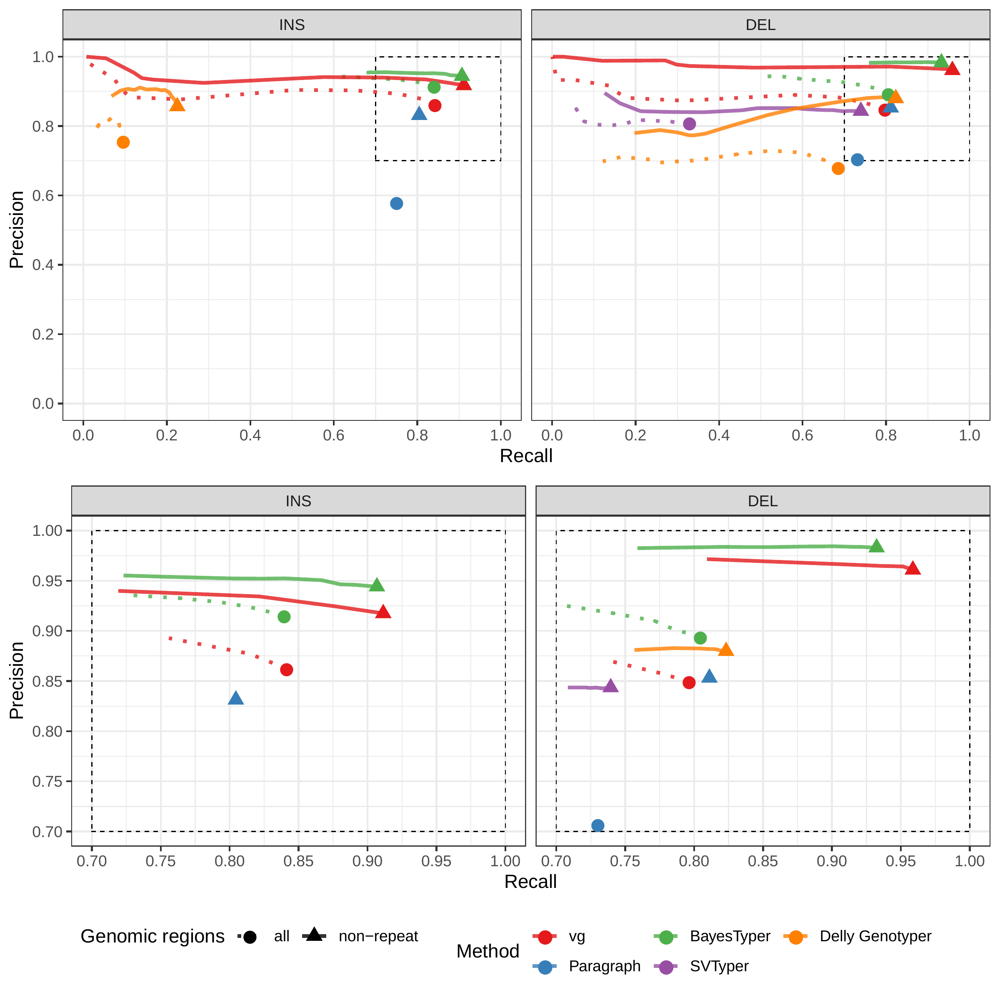
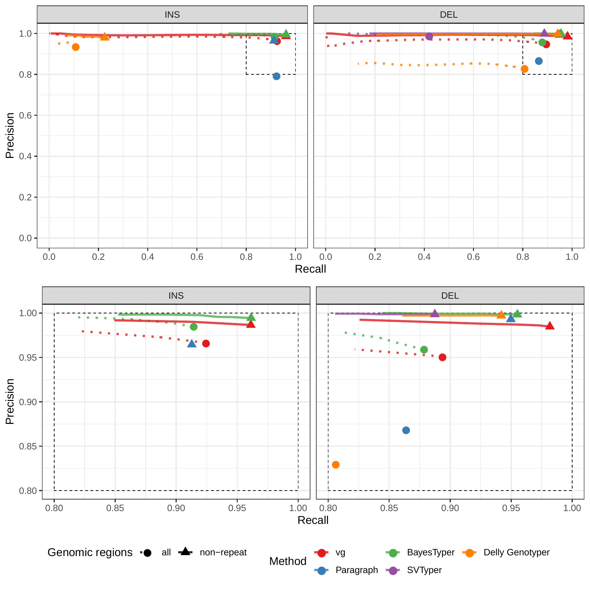
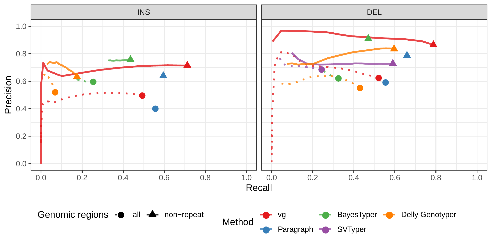
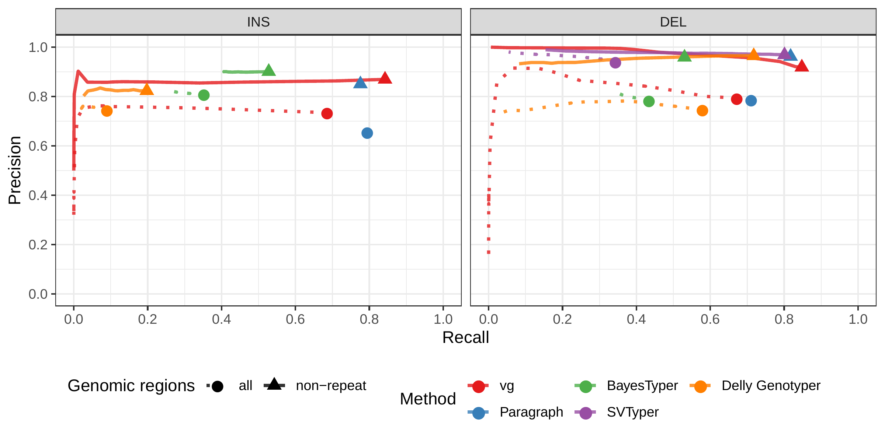

## Supplementary Material

| Experiment      | Method       | Region     | Type | Precision | Recall |    F1 |
|:----------------|:-------------|:-----------|:-----|----------:|-------:|------:|
| Simulated reads | vg-construct | all        | INS  |     0.770 |  0.810 | 0.790 |
|                 |              |            | DEL  |     0.868 |  0.771 | 0.817 |
|                 |              | non-repeat | INS  |     0.891 |  0.873 | 0.882 |
|                 |              |            | DEL  |     0.973 |  0.917 | 0.944 |
|                 | BayesTyper   | all        | INS  |     0.910 |  0.835 | 0.871 |
|                 |              |            | DEL  |     0.893 |  0.807 | 0.848 |
|                 |              | non-repeat | INS  |     0.935 |  0.899 | 0.917 |
|                 |              |            | DEL  |     0.981 |  0.930 | 0.955 |
|                 | svtyper      | all        | DEL  |     0.823 |  0.130 | 0.224 |
|                 |              | non-repeat | DEL  |     0.923 |  0.329 | 0.486 |
|                 | Delly        | all        | INS  |     0.770 |  0.093 | 0.166 |
|                 |              |            | DEL  |     0.695 |  0.707 | 0.701 |
|                 |              | non-repeat | INS  |     0.858 |  0.226 | 0.357 |
|                 |              |            | DEL  |     0.903 |  0.847 | 0.874 |
| Real reads      | vg-construct | all        | INS  |     0.448 |  0.523 | 0.482 |
|                 |              |            | DEL  |     0.614 |  0.522 | 0.564 |
|                 |              | non-repeat | INS  |     0.697 |  0.724 | 0.710 |
|                 |              |            | DEL  |     0.885 |  0.731 | 0.801 |
|                 | BayesTyper   | all        | INS  |     0.587 |  0.227 | 0.327 |
|                 |              |            | DEL  |     0.568 |  0.327 | 0.415 |
|                 |              | non-repeat | INS  |     0.748 |  0.410 | 0.530 |
|                 |              |            | DEL  |     0.869 |  0.412 | 0.559 |
|                 | svtyper      | all        | DEL  |     0.707 |  0.262 | 0.382 |
|                 |              | non-repeat | DEL  |     0.790 |  0.594 | 0.678 |
|                 | Delly        | all        | INS  |     0.540 |  0.063 | 0.113 |
|                 |              |            | DEL  |     0.535 |  0.450 | 0.489 |
|                 |              | non-repeat | INS  |     0.642 |  0.168 | 0.266 |
|                 |              |            | DEL  |     0.866 |  0.577 | 0.692 |

Table: HGSVC experiment. Precision, recall and F1 score for the call set with the best F1 score. {#tbl:hgsvc tag="S1"}

---

| Method       | Region     | Type  |    TP |    FP |    FN | Precision | Recall |    F1 |
|:-------------|:-----------|:------|------:|------:|------:|----------:|-------:|------:|
| vg-construct | all        | Total | 9,415 | 1,369 | 3,085 |     0.873 |  0.753 | 0.809 |
|              |            | INS   | 5,789 | 1,192 | 1,467 |     0.829 |  0.798 | 0.813 |
|              |            | DEL   | 3,626 |   177 | 1,618 |     0.954 |  0.692 | 0.802 |
|              | non-repeat | Total | 2,966 |   273 |   620 |     0.919 |  0.827 | 0.871 |
|              |            | INS   | 2,148 |   270 |   501 |     0.894 |  0.811 | 0.851 |
|              |            | DEL   |   818 |     3 |   119 |     0.996 |  0.873 | 0.931 |
| SMRT-SV2     | all        | Total | 9,224 |     0 | 6,956 |     1.000 |  0.570 | 0.726 |
|              |            | INS   | 5,322 |     0 | 3,631 |     1.000 |  0.594 | 0.746 |
|              |            | DEL   | 3,902 |     0 | 3,325 |     1.000 |  0.540 | 0.701 |
|              | non-repeat | Total | 2,816 |     0 | 1,914 |     1.000 |  0.595 | 0.746 |
|              |            | INS   | 2,020 |     0 | 1,306 |     1.000 |  0.607 | 0.756 |
|              |            | DEL   |   796 |     0 |   608 |     1.000 |  0.567 | 0.724 |

Table: SVPOP experiment. Calling evaluation for the pseudo-diploid genome built from CHM cell lines in Audano et al.[@tag:audano2019]. {#tbl:chmpd tag="S2"}

| Method       | Region     | Type  |     TP |    FP |     FN | Precision | Recall |    F1 |
|:-------------|:-----------|:------|-------:|------:|-------:|----------:|-------:|------:|
| vg-construct | all        | Total | 13,630 | 9,897 | 10,376 |     0.580 |  0.568 | 0.574 |
|              |            | INS   |  8,867 | 7,850 |  5,172 |     0.533 |  0.632 | 0.578 |
|              |            | DEL   |  4,752 | 2,039 |  5,150 |     0.697 |  0.480 | 0.568 |
|              |            | INV   |     11 |     8 |     54 |     0.579 |  0.169 | 0.262 |
|              | non-repeat | Total |  3,864 | 1,165 |    855 |     0.768 |  0.819 | 0.792 |
|              |            | INS   |  2,677 |   985 |    514 |     0.731 |  0.839 | 0.781 |
|              |            | DEL   |  1,180 |   176 |    321 |     0.869 |  0.786 | 0.825 |
|              |            | INV   |      7 |     4 |     20 |     0.636 |  0.259 | 0.368 |

Table: SVPOP experiment. Calling evaluation in the HG5014 individual, one of the 15 individuals used to generate the high-quality SV catalog in Audano et al.[@tag:audano2019]. {#tbl:svpop tag="S3"}

---

{#fig:hgsvc-sim-geno tag="S1"}

{#fig:hgsvc-sim tag="S2"}

{#fig:hgsvc-real-geno tag="S3"}

{#fig:hgsvc-real tag="S4"}

{#fig:yeast-mapping-four tag="S5"}

{#fig:geno-comp-score tag="S6"}
