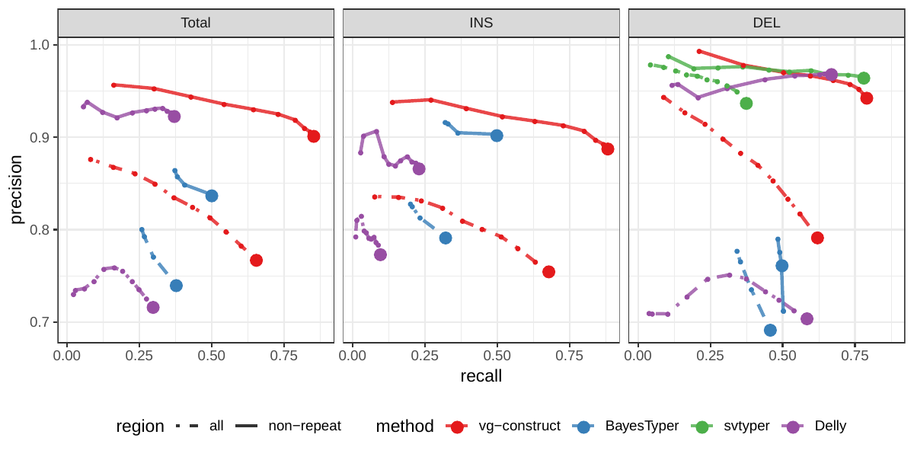

---
author-meta:
- Glenn Hickey
- David Heller
- Jean Monlong
- Jonas Andreas Sibbesen
- Adam Novak
- Benedict Paten
date-meta: '2019-04-10'
keywords:
- structural variation
- pangenome
- variant genotyping
lang: en-US
title: Genotyping structural variation in variation graphs with the vg toolkit
...

<small><em>
This manuscript
([permalink](https://jmonlong.github.io/manu-vgsv/v/68635ebc8006c28218a9014dd934258872e19b73/))
was automatically generated
from [jmonlong/manu-vgsv@68635eb](https://github.com/jmonlong/manu-vgsv/tree/68635ebc8006c28218a9014dd934258872e19b73)
on April 10, 2019.
</em></small>

## Authors

[{height="11px" width="11px"}](https://orcid.org/XXXX-XXXX-XXXX-XXXX)
Glenn Hickey1,☯,
[{height="11px" width="11px"}](https://orcid.org/XXXX-XXXX-XXXX-XXXX)
David Heller1,2,☯,
[{height="11px" width="11px"}](https://orcid.org/XXXX-XXXX-XXXX-XXXX)
Jean Monlong1,☯,
[{height="11px" width="11px"}](https://orcid.org/XXXX-XXXX-XXXX-XXXX)
Jonas Andreas Sibbesen1,
[{height="11px" width="11px"}](https://orcid.org/XXXX-XXXX-XXXX-XXXX)
Adam Novak1,
[{height="11px" width="11px"}](https://orcid.org/XXXX-XXXX-XXXX-XXXX)
Benedict Paten1,†

☯ --- These authors contributed equally to this work

† --- To whom correspondence should be addressed: bpaten@ucsc.edu
<small>

1. UC Santa Cruz Genomics Institute, University of California, Santa Cruz, California, USA
2. Max Planck Institute for Molecular Genetics, Berlin, Germany

</small>

## Abstract {.page_break_before}

Variation graphs have been proposed to represent human pan-genomes, offering reduced reference bias and better mapping accuracy than linear reference genomes. 
Structural variants (SVs) are significant components of genetic diversity and have been associated with diseases, but the technological challenges surrounding their representation and identification make their study difficult relative to point mutations. 
Still, thousands of SVs have been characterized and better catalogs continue to be generated thanks to new technologies.
We contend that variation graphs provide the most elegant representation of such catalogs and an effective means for leveraging them for short-read SV genotyping experiments.
In this work, we extended the vg toolkit for working with variation graphs to support SV genotyping, and showed that it is capable of genotyping insertions, deletions and inversions, even in the presence of small errors in the variant definition.
We then benchmarked vg across three high-quality sequence-resolved SV catalogs generated by recent studies.
vg was compared to state-of-the-art SV genotypers using simulated and real Illumina short reads.
On real data, vg produced the best genotype predictions systematically in all datasets.
Finally, we found that graphs constructed directly from aligned de novo assemblies can improve genotyping compared to graphs built from intermediate SV catalogs in the VCF format.
We experimented with assemblies from 12 yeast strains and showed that the incorporation of only a few assemblies in the graph sufficiently represents genetic variation across all strains.
Our results demonstrate the power of variation graphs for SV genotyping.
Beyond single nucleotide variants and short insertions/deletions, the vg toolkit now includes SV in its unified variant calling framework and provides a natural solution to integrate high-quality SV catalogs and assemblies.

## Introduction {.page_break_before}

A structural variant (SV) is a genomic mutation involving 50 or more base pairs.
SVs can take several forms such as deletions, insertions, inversions, or translocations.
It is intuitive that their greater size relative to smaller events such as single nucleotide variants (SNVs) and small insertions and deletions (indels) would imply that SVs can have a larger impact on phenotype.
Indeed, SVs have long been associated with developmental disorders, cancer and other complex diseases and phenotypes[@ebc66eBr], but remain much more poorly studied than their smaller mutational counterparts.
This discrepancy stems from technological limitation: short read sequencing has provided the basis of most modern genome sequencing studies due to its high base-level accuracy and relatively low cost. However, it is poorly suited for discovering SVs, which often lie in repeat-rich regions and whose lengths can far exceed read sizes.
The central obstacle is in mapping short reads to the human reference genome.
It is generally difficult or impossible to unambiguously map a short read if the sample whose genome is being analyzed differs substantially from the reference at the read's location.
If, for example, the read derives from the middle of what would be termed a large insertion relative to the reference, the best result a read mapper could hope to produce would be to leave it unmapped.
In some cases, SVs can be inferred indirectly from short read mappings via split reads, discordant read pairs, or read depth, but the accuracy of such approaches remains limited[@vQTymKCj].
Assembling deeply sequenced short reads and aligning the contigs or scaffolds back to the reference provides an effective means of SV discovery at increased computational and sequencing cost [@pJAv1D8R]. 

In practice, large-scale projects must often combine short read mapping to several other methods to achieve better accuracy.
This methodology has been used to compile catalogs with tens of thousands of SVs in humans[@qA6dWFP; @py6BC5kj].
Recent developments in sequencing technologies and library preparation continue to pave the way for better SV detection.
Several recent studies using long-read or linked-read sequencing have produced large catalogs of structural variation, the majority of which was novel and sequence-resolved[@z91V6jjU; @rs7e40wC; @PRx3qEIm; @121OWcTA4; @3NNFS6U2].
These technologies are also enabling the production of high-quality de novo genome assemblies[@z91V6jjU; @6KbgcueR], and large blocks of haplotype-resolved sequences[@Pu6SY37C].
Such technical advances promise to expand the amount of known genomic variation in humans in the near future.
However, their cost prohibits their use in large-scale studies that require hundreds or thousands of samples, such as disease association studies.

Representing structural variation poses an additional challenge.
Standard formats such as VCF are unweildly when used for SVs due to ambiguity in their specification and limited support across tools.
Incorporating SVs into a linear pan-genome reference via alt contigs involves custom pipelines and non-standard metadata formats linking the contigs back to the reference.
They often contain redundant sequence.
These issues make them difficult to use, maintain and scale as SV catalogs continue to expand.
[todo: cite? even just grch38 is a pretty good case study of how awful this is]
Development of pan-genome graph reference representations offers a solution to such problems [@Qa8mx6Ll].  
The graph structure enables SVs to be as succinctly and directly represented as point mutations.  
By including variants in the graph, both read mapping and variant calling become variant-aware and benefit in terms of accuracy and sensitivity[@10jxt15v0; @DuODeStx; @11Jy8B61m].
In addition, different variant types are called simultaneously by a unified framework.
vg is the first openly available variation graph tool to scale to multi-gigabase genomes and provides read mapping, variant calling and haplotype modeling[@10jxt15v0].
In vg, graphs can be built from both variant catalogs in the VCF format or from assembly alignments.
Other genome graph implementations have also been used specifically to genotype variants.
Using a sliding-window approach, GraphTyper realigns reads to a graph built from known SNVs and short indels[@ohTIiqfV].
BayesTyper builds graphs with both short variants and SVs, and genotypes variants based on the k-mer distribution of sequencing reads[@14Uxmwbxm].
Here again, the graph-based approaches showed clear advantages over standard methods that use the linear reference.

Other SV genotyping approaches typically compare read mapping to the reference genome and to a sequence modified with the SV. 
For example SMRT-SV was designed to genotype SVs identified on PacBio reads[@rs7e40wC].
SVTyper uses paired-end mapping and split-read mapping information and can genotype deletions, duplications, inversions and translocations[@AltPnocw].
Delly provides a genotyping feature in addition to its discovery mode and can genotype all types of SVs although the VCF needs special formatting for some[@nLvQCjXU].
SMRT-SV2 is a machine learning tool that was trained to genotype SVs from the alignment of reads to the reference genome augmented with SV-containing sequences as alternate contigs[@3NNFS6U2].
[todo: I think we need to expand on the description of these methods, especially smrt-sv.  I will take a stab in a future pass]

We show that the unified variant calling framework implemented in vg is capable of genotyping deletions, insertions and inversions.
We compare vg with state-of-the-art SV genotypers: SVTyper[@AltPnocw], Delly[@nLvQCjXU], BayesTyper[@14Uxmwbxm] and SMRT-SV2[@3NNFS6U2].
On simulated variants, vg is robust to small errors in the breakpoint location and outperforms most other methods on shallow sequencing experiments.
Starting from SVs discovered in recent long-read sequencing studies[@3NNFS6U2;@vQTymKCj;@14neTdqfN;@16GvGhO20], we evaluated the genotyping accuracy when using simulated or real Illumina reads.
Across all three datasets that we tested, vg is the best performing SV genotyper on real short-read data for all SV types.
Going further, we show that building graphs from the alignment of de novo assemblies leads to better genotyping performance.

## Results

### Structural variation in vg

A variation graph encodes DNA sequence in its nodes.
Such graphs are bidirected, in that we distinguish between edges incident on the starts of nodes from those incident on their ends.
A path in such a graph is an  ordered list of nodes where each is associated with an orientation.
If a path walks from, for example, node A in the forward orientation to node B in the reverse orientation, then an edge must exist from the end of node A to the end of node B.
Concatenating the sequences on each node in the path, taking the reverse complement when the node is visited in reverse orientation, produces a string, and it is in this way that haploid sequences are embedded in the graph.
Variation between sequences shows up as bubbles in the graph [@xJlNnKH2].
(Figure {@fig:1}a). shows how a graph with SNP and an indel can be extended to contain more complex SVs.

The vg toolkit provides open source tools for constructing and mapping reads to such variation graphs [@10jxt15v0].
We used it to implement a simple SV genotyping pipeline, described as follows and in more detail in [Methods](#simulation-experiment).
Reads are mapped to the graph and used to compute the read support for each node and edge.
Sites of variation are then identified using the snarl decomposition as described in [@xJlNnKH2].
For each site, the two most supported paths (haplotypes) are determined, and their relative supports used to produce a genotype at that site.

As a proof-of-concept we simulated genomes and different types of SVs with a size distribution matching real SVs[@vQTymKCj].
We compared vg against SVTyper, Delly and BayesTyper across different levels of sequencing depth.
Some errors were also added at the breakpoints to investigate their effect on genotyping accuracy (see [Methods](#simulation-experiment)).
The results are shown in Figure {@fig:1}b.
When using the correct breakpoints, vg tied with Delly as the best genotyper for deletions, and with BayesTyper as the best genotyper for insertions.
For inversions, vg was the second best genotyper after BayesTyper.
The differences between the methods were the most visible at lower sequencing depth. 
In the presence of 1-10 bp errors in the breakpoint definition, the performance of Delly and BayesTyper dropped significantly.
The dramatic drop for BayesTyper can be explained by its khmer-based approach that requires exact SV definition.
In contrast, vg was only slightly affected by the presence of errors in the input VCF (Figure {@fig:1}b).
For vg, the F1 scores for all SV types decreased no more than 0.07 point.
Overall, these results show that vg is capable of genotyping SVs and is robust to errors in the input VCF.

{#fig:1}

### HGSVC dataset

The Human Genome Structural Variation Consortium (HGSVC) generated a high-quality SV catalog from three samples, obtained using a consensus from different sequencing, phasing and variant calling technologies[@vQTymKCj]. 
The three samples come from different human populations: a Han Chinese individual (HG00514), a Puerto-Rican individual (HG00733), and a Yoruban Nigerian individual (NA19240).
These SVs were used to construct a graph with vg and as input for the other genotypers.
SVs were genotyped from short reads and compared with the original catalog (see [Methods](#hgsvc-analysis)).

First, by simulating reads for HG00514, we compared the different methods in the ideal situation where the SV catalog is correct and matches exactly the SVs supported by the reads.
While vg outperformed Delly and SVTyper, BayesTyper showed the best F1 score and precision-recall trade-off (Figures {@fig:2} and {@fig:hgsvc-sim-geno}, Table {@tbl:hgsvc}).
When restricting the comparisons to regions not identified as tandem repeats or segmental duplications, the genotyping predictions were significantly better for all methods, with vg almost as good as BayesTyper on deletions (F1 of 0.944 vs 0.955).
We observed similar results when evaluating the absence/presence of a SV instead of the exact genotype (Figures {@fig:2} and {@fig:hgsvc-sim}).
Overall, both graph-based methods, vg and BayesTyper, outperformed the other two methods tested.

We then repeated the analysis using real Illumina reads from HG00514, to benchmark the methods on a more realistic experiment.
Here vg clearly outperformed other approaches, most likely because of its graph-based strategy and robustness to errors in the SV catalog (Figures {@fig:2} and  {@fig:hgsvc-real-geno}).
In non-repeat regions and across the whole genome, the F1 scores and precision-recall curves were higher for vg compared to other methods. 
For example, for deletions in non-repeat regions, the F1 score for vg was 0.801 while the second best method, Delly, had a F1 score of 0.692.
We observed similar results when evaluating the absence/presence of a SV instead of the exact genotype (Figures {@fig:2} and {@fig:hgsvc-real}).

![**Structural variants from the HGSVC and Genome in a Bottle datasets**. 
HGSVC: Simulated and real reads were used to genotype SVs and compared with the high-quality calls from Chaisson et al.[@vQTymKCj].
Reads were simulated from the HG00514 individual.
Using real reads, the three HG00514, HG00733, and NA19240 individuals were tested.
GiaB: Real reads from the HG002 individual were used to genotype SVs and compared with the high-quality calls from the Genome in a Bottle consortium[@14neTdqfN;@16GvGhO20].
Maximum F1 score for each method (color), across the whole genome or focusing on non-repeat regions (x-axis). 
The calling and genotyping evaluation are shown with different shades.
](images/hgsvc-giab-best-f1.png){#fig:2}

### Other long-read datasets

The Genome in a Bottle (GiaB) consortium is currently producing a high-quality SV catalog for a Ashkenazim individual (HG002)[@14neTdqfN;@16GvGhO20].
Dozens of SV callers and datasets from short, long and linked reads were used to produce this set of SVs.
vg performed similarly on this dataset as on the HGSVC dataset, with a F1 score of 0.75 for both insertions and deletions in non-repeat regions (Figures {@fig:2}, {@fig:giab-geno} and {@fig:giab}, and Table {@tbl:giab}).
As before, other methods produced lower F1 scores in most cases, although Delly and BayesTyper predicted better genotype for deletions in non-repeat regions.
Because this catalog contained SVs for only one individual, this benchmark is mostly relevant to compare the recall which is what contributes most to the F1 score differences (Figure {@fig:giab}).

A recent study by Audano et al. generated a SV catalog using long-read sequencing across 15 individuals [@3NNFS6U2].
These variants were then genotyped from short reads across 440 individuals using SMRT-SV2, a machine-learning genotyper implemented for this study.
We first called SVs from the pseudo-diploid genome and reads used to train SMRT-SV2 and constructed by merging datasets from two haploid cell lines[@3NNFS6U2].
The absence/presence predictions from vg were systematically better than SMRT-SV2 for both SV types but SMRT-SV2 produced better genotypes for deletions (see Figures {@fig:chmpd-svpop}, {@fig:chmpd-geno} and {@fig:chmpd}, and Table {@tbl:chmpd}). 
Using publicly available Illumina reads, we then genotyped SVs in 3 of the 15 individuals that were used for discovery in Audano et al.[@3NNFS6U2].
Compared to SMRT-SV2, vg had a better precision-recall curve and a higher F1 for both insertions and deletions (Figures {@fig:chmpd-svpop} and {@fig:svpop}, and Table {@tbl:svpop}).
Of note, SMRT-SV2 produces *no-calls* when the read coverage is too low and we observed that its recall increased when filtering these regions out.
Interestingly, vg performed well even in regions where SMRT-SV2 produced *no-calls* (Figure {@fig:svpop-regions} and Table {@tbl:svpop-regions}).
Finally, Audano et al. had identified 217 sequence-resolved inversions.
vg correctly predicted the presence of around 14% of the inversions present in the three samples (Table {@tbl:svpop}).
Inversions are often complex, harboring additional variation that makes their characterization and genotyping challenging.

![**Structural variants from Audano et al.[@3NNFS6U2]**.
The pseudo-diploid genome built from CHM cell lines was originally used to train SMRT-SV2 in Audano et al.[@3NNFS6U2].
The SVPOP panel shows the combined results for the HG5014, HG00733 and NA19240 individuals, 3 of the 15 individuals used to generate the high-quality SV catalog in Audano et al.[@3NNFS6U2].
Maximum F1 score for each method (color), across the whole genome or focusing on non-repeat regions (x-axis). 
The calling and genotyping evaluation are shown with different shades.
](images/chmpd-svpop-best-f1.png){#fig:chmpd-svpop}

### Breakpoint fine-tuning

*(Maybe better in discussion.)*

In addition to genotyping, vg can use an augmentation step to modify the graph based on the read alignment and discover novel variants.
On the simulated SVs from Figure {@fig:1}b, this approach was able to correct many of the 1-10 bp breakpoint errors injected in the input VCF.
The breakpoints were accurately fine-tuned for 93.8% of the insertions (Figure {@fig:simerror-bkpt}a and Table {@tbl:simerror-bkpt}).
For deletions, 78.1% of the variants were corrected when only one breakpoint had an error.
In situations where both breakpoints of the deletions were incorrect, only 18.6% were corrected through graph augmentation, and only when the amount of error was small (Figure {@fig:simerror-bkpt}b).
The breakpoints of less than 20% of the inversions could be corrected.
Across all SV types, the size of the variant didn't affect the ability to fine-tune the breakpoints through graph augmentation (Figure {@fig:simerror-bkpt}c).

### Graphs from alignment of de novo assemblies

Genome graphs can be constructed directly from multiple sequence alignments [@10jxt15v0].
This bypasses the need of going through a variant caller which could be a source of error from, for example, reference bias.
Furthermore, genome alignments from software such as Cactus [@1FgS53pXi] can contain complex structural variation that is extremely difficult to represent outside of a graph, let alone call.
We therefore investigated whether genome graphs derived from de-novo assembly alignments yield advantages for SV genotyping.
To this end, we analyzed public sequencing datasets for 12 yeast strains from two related clades (*S. cerevisiae* and *S. paradoxus*) [@7f5OKa5O].
We are presently working on scaling this pipeline to human-sized genomes.

By generating genome graphs from only five of the strains we could measure how well variation from a small subset of strains represents the variation present in the full set of 12 strains.
We generated and compared two different types of genome graphs.
The first graph type (in the following called *construct graph*) was created from a linear reference genome of the *S.c. S288C* strain and a set of SVs relative to this reference strain in VCF format.
We compiled the SV set using the output of three methods for SV detection from genome assemblies: Assemblytics [@krO7WgVi], AsmVar [@oVaXIwl5] and paftools [@172cJaw4Q].
All three methods were run to detect SVs between the reference strain and each of the other strains.
Merging the results from the three methods and four of the eleven strains provided us with a representative set of SVs occurring in the two yeast clades that we could use to construct the *construct graph*.
The second graph (in the following called *cactus graph*) was derived from a multiple genome alignment of the five strains using our Cactus tool [@1FgS53pXi].
While the *construct graph* is still mainly linear and highly dependent on the reference genome, the *cactus graph* is completely unbiased in that regard.

{#fig:3}

First, we tested our hypothesis that the *cactus graph* has higher mappability due to its better representation of sequence diversity among the yeast strains.
Figure {@fig:3}a shows the fraction of Illumina reads from the 12 strains that was mapped with a mapping quality above a certain threshold to the *cactus graph* and to the *construct graph*.
Generally, more reads were mapped to the *cactus graph* than to the *construct graph* regardless of the chosen mapping quality threshold.
Only for the reference strain *S.c. S288C*, the *construct graph* exhibited slightly better mappability.
This suggests that the improvement in mappability is not driven by the higher sequence content in the *cactus graph* alone (15.4 Mb compared to 12.4 Mb in the *construct graph*).
Instead, our measurements suggest that the genetic distance to the reference strain correlates with the better mapping on the *cactus graph* over the *construct graph*.
Consequently, the benefit of using the *cactus graph* is largest for strains in the *S. paradoxus* clade and smaller for reads from strains in the *S. cerevisiae* clade.

We observed a similar trend when exploring the mapping identity of the short reads on the graphs (see Figure {@fig:3}b).
For strains in the *S. paradoxus* clade, the *cactus graph* resulted in substantially more mappings with high percent identity than the *construct graph*.
With strains in the *S. cerevisiae* clade, the difference was smaller, at least for a percent identity threshold up to 90%.
When comparing read fractions with perfect identity (i.e. percent identity threshold = 100%), the *cactus graph* clearly outperforms the *construct graph* on 11 out of 12 samples, the exception again being the reference strain *S.c. S288C*.

Interestingly, our measurements did not show a substantial difference between strains included in the graph and excluded strains. The results suggest that two strains from each clade as well as the reference strain are sufficient to capture most of the genetic variation among all the strains. Only the number of alignments with perfect identity is substantially lower for the strains that were not included in the creation of the graphs (see Figure {@fig:3}b). For a direct comparison, see Figure {@fig:panel5} which shows results of the same experiment on graphs generated from all 12 strains.

Next, we compared the SV genotype performance of both graphs.
We mapped short reads from the 11 non-reference strains to both graphs and called variants for each strain using the vg toolkit's variant calling module (see [Methods](#toil-vg-call)).
In the absence of a gold standard, we evaluated each callset based on the alignment of reads to a *sample graph* constructed from the callset (see [Methods](#calling-and-genotyping-of-svs)).
If a given callset is correct, we expect that reads from the same sample will be mapped confidently and with high identity to the corresponding sample graph.
Therefore, we compared the average mapping quality and percent identity of the short reads on each sample graph (see Figures {@fig:4}a and b).
Similar to the results of our mapping analysis above, the *cactus graph* clearly outperformed the *construct graph* for strains in the *S. paradoxus* clade and performed slightly better for strains in the *S. cerevisiae* clade.
Again, our measurements did not show a large difference between strains included in the graph and those that were excluded. For a direct comparison, see Figure {@fig:panel6} which shows results of the same experiment on graphs generated from all 12 strains.

![**SV genotyping comparison.**
Short reads from all 11 non-reference yeast strains were used to genotype SVs contained in both graphs. 
Subsequently, sample graphs were generated from the resulting SV callsets. 
The short reads were again aligned to the sample graphs and the quality of the alignments was used to ascertain genotyping performance.
a) Average mapping quality of short reads aligned to the sample graphs derived from *cactus graph* (y-axis) and *construct graph* (x-axis).
b) Average mapping identity of short reads aligned to the sample graphs derived from *cactus graph* (y-axis) and *construct graph* (x-axis). 
Colors and shapes represent the 11 non-reference strains and two clades, respectively. 
Transparency indicates whether the strain was included or excluded in the graphs.
](images/panel4.png){#fig:4}

## Methods

### Toil-vg

Toil-vg is a set of Python scripts for simplifying vg tasks such as graph construction, read mapping and SV genotyping.  It uses the Toil workflow engine [@faeC2cx0] to seamlessly run pipelines locally, on clusters or on the cloud.  All variation graph analysis in this report was done using toil-vg, with the exact commands available [here](https://github.com/glennhickey/hgsvc) [todo: get everything in one place with reasonable docs].  The principal toil-vg commands used are described below.

#### Toil-vg construct

Toil-vg construct automates graph construction and indexing following the best practices put forth by the vg community.
Graph construction is parallelized across different sequences from the reference fasta, and different whole-genome indexes are created side by side when possible.
Phasing information from the input VCF can be used when available to preserve haplotypes in the GCSA2 pruning step, as well as to extract haploid sequences to simulate from.

#### Toil-vg map

Toil-vg map splits the input reads into batches, maps each batch in parallel, then merges the result.

#### Toil-vg call

A simple though very general variant caller has been implemented as `vg call`.
Here it is used to genotype structural variants already present in the graph, but the same algorithm can also be used for smaller variants such as SNPs, as well as making de-novo calls.
The algorithm is as follows:

1. The average read support for each node and edge, adjusted for mapping and base quality, is computed. 
The graph can optionally be augmented to include new variation from the reads using a support cutoff.
1. The graph is then decomposed into snarls. 
Briefly, a snarl is a subgraph defined by two end nodes, where cutting the graph at these nodes disconnects the snarl from the rest of the graph.
Snarls can be nested inside other snarls, and this nesting hierarchy forms a forest (todo: I don't think chains get used anywhere in vg call so we can ignore here). 
The snarl decomposition is a fundamental structure for identifying variants in a graph and were formally defined by Paten et al.[@xJlNnKH2], along with an algorithm to identify them.
1. Root-level snarls from the decomposition are considered independently and in parallel. 
Only snarls whose two ends lie on a reference (i.e. chromosome) path are considered as the VCF format used for output requires reference positions. 
The following steps are performed on each root snarl. 
    1. A set of paths between the snarls end nodes are computed using a heuristic search that enumerates paths until all nodes and edges in the snarl are contained in at least one path.
    1. The paths are ranked according to their average support.
    1. A genotype is determined using the relative support of the best paths, as well as the background read depth. The same logic is used for all types of variation, each of which can be expressed simply as a path in the graph.
    1. The VCF variants are derived from the paths.

Due to the high memory requirements of the current implementation of vg call, toil-vg call splits the input graph into 2.5Mb overlapping chunks along the reference path.
Each chunk is called independently in parallel and the results are concatenated into the output VCF. 

#### Toil-vg sveval

The variants are first normalized with `bcftools norm` to ensure consistent representation between called variants and baseline variants.
We then implemented an overlap-based strategy to compare SVs and compute evaluation metrics (sveval R package: [https://github.com/jmonlong/sveval](https://github.com/jmonlong/sveval)).

For deletions and inversions, the affected regions in the reference genome are overlapped and matched between the two sets of SVs.
First, we select pairs of SVs with at least 10% reciprocal overlap.
Then for each variant we compute the proportion of its region that is covered by an overlapping variant in the other set.
If this coverage proportion is higher than 50%, the variant is considered *covered*.
True positives are *covered* variants from the call set or the truth set.
False positives are variants from the call set that are not *covered*.
False negative are variants from the truth set that are not *covered*.

For insertions, we select pairs of insertions that are located no farther than 20 bp from each other.
We then align the inserted sequences using a Smith-Waterman alignment.
For each insertion we compute the proportion of its inserted sequence that aligns a matched variant in the other set.
As for deletions/inversions, this coverage proportion is used to annotate variants as true positives, false positives and false negatives.

sveval accepts VCF files with symbolic or explicit representation of the SVs.
If the explicit representation is used, multi-allelic variants are split and their sequences right-trimmed.
When inversions are considered, the reverse-complement of the ALT sequence of variants larger than 10 bp is aligned to the REF sequence and classified as an inversion if more than 80% of the sequence aligns.

We assess either the *calling* performance (absence/presence of a SV) or the *genotyping* performance.
For the *calling* evaluation, both heterozygous and homozygous alternate SVs are compared jointly using the approach described above.
To compute genotype-level metrics, the heterozygous and homozygous SVs are compared separately.
Before splitting the variants by genotype, consecutive heterozygous variants are first stitched together if located at less that 20 bp from each other.
Pairs of heterozygous variants with reciprocal overlap of at least 80% are also merged into homozygous variant before splitting variants by genotype.

### Other SV genotypers

#### BayesTyper

If not specified otherwise BayesTyper was run as follows.
Raw reads were mapped to the reference genome using `bwa mem`.
GATK and Platypus were run on the mapped reads to call SNVs and short indels (<50bp).
The VCFs with these variants and the SVs to genotype were combined and used as input for BayesTyper.
The BayesTyper genotyping pipeline started by counting the kmers in the raw reads using `kmc -k55 -ci1 -m8`.
These kmers are then passed through a Bloom filter using `bayesTyperTools makeBloom`.
Finally, variants are clustered and genotyped using `bayestyper cluster` and `bayestyper genotype --min-genotype-posterior 0`.

#### Delly

The `delly call` command was run on the reads mapped by `bwa mem`, the reference genome fasta file and the VCF containing the SVs to genotype in their explicit representation.

#### SVTyper

The VCF containing deletions was converted to symbolic representation and passed to `svtyper` with the reads mapped by `bwa mem`.
The output VCF was converted back to explicit representation using `bayesTyperTools convertAllele` to facilitate variant normalization before evaluation.

#### SMRT-SV2

SMRT-SV2 was run with the "30x-4" model and min-call-depth 8 cutoff.
It was run only on VCFs created by SMRT-SV, for which the required contig BAMs were available.
The Illumina BAMs used where the same as the other methods described above.
The output VCF was converted back to explicit representation to facilitate variant normalization later.

### Simulation experiment

We simulated a synthetic genome with 1000 insertions, deletions and inversions.
Each variant was separated from the next by a buffer region of 500 bp.
The size of deletions and insertions followed the distribution of real SVs from the HGSVC catalog.
We used the same size distribution as deletions for inversions.
A VCF file was produced for three simulated samples with random genotypes (homozygous reference, heterozygous, homozygous alternate).

We created another VCF file containing errors in the SV definition.
One or both breakpoints of deletions and inversions were shifted between 1 and 10 bp.
The location and sequence of insertions were also modified, either shifted or deleted at the flanks, again by up to 10 bp. 

Paired-end reads were simulated using `vg sim` on the graph that contained the true SVs.
Different read depths were tested: 1x, 3x, 7x, 10x, 13x, 20x.
We used real Illumina reads from NA12878 provided by the Genome in a Bottle consortium to model base qualities and sequencing errors.

The different methods were tested using either the true VCF or the VCF that contained errors.
For vg, a graph was constructed from the VCF file, indexed, then used to map simulated reads and call variants using toil-vg (see [Toil-vg](#toil-vg)).
A beta version 1.5 of BayesTyper was run directly on the simulated reads and using an input VCF with SV only.
In order to run the other methods, reads were mapped to the linear reference sequence using `bwa mem` and sorted using `samtools`.
For Delly, insertions and deletions were first genotyped together using these mapped reads and the `delly call` command.
Inversions were genotyped separately using a VCF that was formatted according to Delly's preference.
SVTyper was run on the mapped reads and a VCF that was converted to symbolic variant representation.
All commands used for this analysis are available at [ANALYSIS_REPO](XXX).

The genotypes called in each experiment (method/VCF with or without errors/sequencing depth) were compared to the true SV genotypes to compute the precision, recall and F1 score (see [Toil-vg sveval](#toil-vg-sveval)).

#### Breakpoint fine-tuning using graph augmentation

vg can call variants after augmenting the graph with the read alignments to discover new variants (see [Toil-vg call](#toil-vg-call)).
We tested if this approach could fine-tune the breakpoint location of SVs in the graph.
We started with the graph that contained approximate SVs (1-10 bp errors in breakpoint location) and 20x simulated reads from the simulation experiment (see [Simulation experiment](#simulation-experiment)).
The variants called after graph augmentation were compared with the true SVs and considered fine-tuned if the breakpoints matched exactly.

### HGSVC Analysis

Phased VCFs were obtained for the three HGSVC samples from Chaisson et al.[@vQTymKCj] and combined with `bcftools merge`.
A variation graph was created and indexed using the combined VCF and the HS38D1 reference with alt loci excluded.
The phasing information was used to construct a GBWT index, from which the two haploid sequences from HG00514 were extracted.
Illumina read pairs with 30x coverage were simulated from these sequences using vg, with an error model learned from real reads from the same sample.
Still, these reads reflect the idealized situation where the breakpoints of the SVs being genotyped are exactly known a priori.
The reads were mapped to the graph and the mappings used to genotype the SVs in the graph, which were finally compared back to the HG00514 genotypes from the HGSVC VCF.
The process was repeated with the same reads on the linear reference, using bwa-mem for mapping and Delly, SVTyper and BayesTyper for SV genotyping.

Illumina HiSeq 2500 paired end reads were downloaded from the EBI's ENA FTP site for the three samples, using Run Accessions ERR903030, ERR895347 and ERR894724 for HG00514, HG00733 and NA19240, respectively.
The graph and linear mapping and genotyping pipelines were run exactly as for the simulation, and the comparison results were aggregated across the three samples.

### GIAB Analysis

Version 0.6 of the GIAB SV VCF for the Ashkenazim son (HG002) was obtained from the NCBI FTP site.
Illumina reads downsampled to 50x coverage obtained as described in Garrison et al.[@10jxt15v0], were used to run the vg and linear SV genotyping pipelines described above though with GRCh37 instead of 38.
Since this dataset contains only one sample, variants without a determined genotype (14649 out of 74012) were considered "false positives" as a proxy measure for precision.

### SMRT-SV2 Comparison (CHMPD and SVPOP)

The SMRT-SV2 genotyper can only be used to genotype VCFs that were created by SMRT-SV2, and therefore could not be run on our simulated, HGSVC or GIAB data.
The authors shared their training and evaluation set, a pseudodiploid sample constructed from combining the haploid CHM1 and CHM13 samples, along with a negative control (NA19240). 
The high quality of the CHM assemblies makes this set an attractive alternative to using simulated reads.
We used this two-sample pseudodiploid VCF along with the 30X read set to construct, map and genotype with vg, and also ran SMRT-SV2 genotyper with the "30x-4" model and min-call-depth 8 cutoff, and compared the two back to the original VCF.

In an effort to extend this comparison to a more realistic setting, we reran the three HGSVC samples against the SMRT-SV2 discovery VCF (which contains them in addition to 12 other samples) published by Audano et al.[@3NNFS6U2] using vg and SMRT-SV2 Genotyper.
The discovery VCF does not contain genotypes so we did not distinguish between heterozygous and homozygous genotypes, looking at only the presence or absence of an alt allele for each variant.

SMRT-SV2 produces some explicit *no-calls* predictions when the read coverage is too low to produce accurate genotypes.
These no-calls are considered homozygous reference in the main accuracy evaluation.
We also explored the performance of vg and SMRT-SV2 in different sets of regions:

1. Non-repeat regions, i.e. excluding segmental duplications and tandem repeats.
1. Repeat regions defined as segmental duplications and tandem repeats.
1. Regions where SMRT-SV2 could call variants.
1. Regions where SMRT-SV2 produced no-calls.

### Yeast graph analysis

For the analysis of graphs from de novo assemblies, we utilized publicly available PacBio-derived assemblies and Illumina short read sequencing datasets for 12 yeast strains from two related clades (Table {@tbl:strains}) [@7f5OKa5O].
Two different genome graphs were constructed from the assemblies of five selected strains (*S.c. S288C*, *S.c. SK1*, *S.c. YPS128*, *S.p. CBS432*, and *S.p. UFRJ50816*).
In the following, we describe the steps for the construction of both graphs and the calling of variants.
For more details and the precise commands used in our analyses, see the following GitHub repository: https://github.com/eldariont/yeast_sv.

(todo: merge all analysis code to one documented repo)

| Strain      | Clade         | Included in graph |
|-------------|---------------|-------------------|
| S288C       | S. cerevisiae | ✓                 |
| SK1         | S. cerevisiae | ✓                 |
| YPS128      | S. cerevisiae | ✓                 |
| UWOPS034614 | S. cerevisiae |                   |
| Y12         | S. cerevisiae |                   |
| DBVPG6765   | S. cerevisiae |                   |
| DBVPG6044   | S. cerevisiae |                   |
| CBS432      | S. paradoxus  | ✓                 |
| UFRJ50816   | S. paradoxus  | ✓                 |
| N44         | S. paradoxus  |                   |
| UWOPS919171 | S. paradoxus  |                   |
| YPS138      | S. paradoxus  |                   |

Table: 12 yeast strains from two related clades were used in our analysis. Five strains were selected to be included in the graphs while the remaining seven were used for variant calling only. {#tbl:strains}

#### Construction of the *construct graph*

For the first graph (called *construct graph* throughout the paper), the most common graph construction method was applied.
It requires a linear reference genome and a VCF file of variants on that reference to build the graph.
As reference genome, the PacBio assembly of the S.c. S288C strain was chosen because this strain was used for the S. cerevisiae genome reference assembly.
To obtain variants three methods for SV detection from genome assemblies were combined: Assemblytics [@krO7WgVi] (commit df5361f), AsmVar (commit 5abd91a) [@oVaXIwl5] and paftools (version 2.14-r883) [@172cJaw4Q].
All three methods were run to detect SVs between the PacBio assembly of reference strain S.c. S288C and the PacBio assemblies of each of the four other selected yeast strains.
The union of variants detected by the three methods was produced (using bedtools [̍@1HWiAHnIw]) and variants with a reciprocal overlap of at least 50% were combined to avoid duplication in the union set.
These union sets of variants for each of the four selected (and non-reference) strains were merged and another deduplication step was applied to combine variants with a reciprocal overlap of at least 90%.
The resulting total set of variants in VCF format and the linear reference genome were used to build the *construct graph* with `vg construct`.

#### Construction of the *cactus graph*

For the second graph (called *cactus graph* throughout the paper), an alternative graph construction methods directly from de novo genome assemblies was applied.
First, the repeat-masked PacBio-assemblies of the five selected strains were aligned with our Cactus tool [@1FgS53pXi].
Cactus requires a phylogenetic tree of the strains which was estimated using Mash [@mH9pzoIn] and PHYLIP.
Subsequently, the output file in HAL format was converted to a variant graph with hal2vg ([https://github.com/ComparativeGenomicsToolkit/hal2vg](https://github.com/ComparativeGenomicsToolkit/hal2vg)).

#### Calling and genotyping of SVs

Prior to variant calling, the Illumina short reads of all 12 yeast strains were mapped to both graphs using `vg map`.
The fractions of reads mapped with specific properties were measured using `vg view` and the JSON processor `jq`.
Then, `toil-vg call` (commit be8b6da) was used to analyze the mapped reads of each of the 11 non-reference strains and to call variants.
Thus, a separate variant callset was obtained for each of the strains and both graphs.
To evaluate the callsets, a sample graph (i.e. a graph representation of the callset) was generated for each callset using `vg construct` and `vg mod` on the reference assembly *S.c. S288C* and the callset.
Subsequently, short reads from the respective strains were mapped to each sample graph using `vg map`.
The resulting alignments were analyzed with `vg view` and `jq`.

## Discussion

*Potential topics for the discussion.*
*This section still needs a fair amount of work.*

#### Performance across datasets

vg was, overall, the most accurate genotyper in our benchmarks.
The other methods were superior in a handful datasets and situations, primarily when genotyping deletions.
That vg generally had the best accuracy when restricting the comparison to presence/absence even in most of these cases is evidence that the performance shortfall can be attributed to the graph genotyping rather than mapping pipeline.
We hope to address these issues in a future release.
The quality of the input SV catalog also has an impact on relative performance.
The GiaB catalog is more curated and, specifically for deletions in non-repeat regions, Delly and BayesTyper were better at predicting genotypes compared to vg.
This might be because the breakpoint resolution for this type of SV in these regions is better in this dataset compared to the HGSVC dataset which was derived mostly from long-read sequencing.
Similarly, SMRT-SV2 performs better for deletions in the pseudo-diploid genome constructed from two high quality genome assemblies of CHM cell lines.
 
#### Providing a resource to be used by large-scale sequencing project

As a result of this study we provide a variation graph containing XX millions of SNVs and indels from the 1000 Genomes Project as well as XX thousands of SVs derived from long-read sequencing.
This variation graph could serve as a richer reference for large scale projects that use short-read sequencing.
For instance, more and more large-scale projects are sequencing the genomes of thousands or hundreds of thousands of individuals, e.g. the Pancancer Analysis of Whole Genomes[@10Jid8Wql], the Genomics England initiative[@mWj2p7Xp], and the TOPMed consortium[@ir1O1h8n].
These large WGS studies will provide a deeper look into the mechanism of common diseases and, in some cases, will be used directly in a clinical setting.
Clinicians and researchers are eager to use these growing WGS resources to interrogate the importance of SVs in disease at a scale never achieved before, either to get a more complete picture of the genetic factors of a disease or to produce a more comprehensive clinical report.
As sequencing reaches the clinic, whole-genome sequencing will become routine for many patients.
Clinicians will rely on variant calling and interpretation for diagnosis and treatment.
For variant interpretation in particular, a comprehensive and unified characterization of the genomic variation will be extremely valuable. 

#### Simplified usage

Some methods require additional information or special VCF formatting [@16glGyppX].
SVTyper was designed to use VCFs created by Lumpy.
The genotyping module from Delly was implemented for variants found by its discovery module.
SMRT-SV2 required the VCF created specifically for it by Audano et al.[@3NNFS6U2].
Nebula, a new k-mer-based genotyper, requires reads from a individual with the SV during k-mer selection[@zRHJDqQ9].
In contrast, vg can take as input either explicit or symbolic VCFs, as well as assembly alignment.

#### Benefits of de novo assemblies

Our results suggest that constructing a graph from de novo assembly alignment is more representative of the sequencing reads and leads to better SV genotyping.
De novo assemblies for human are becoming more and more common, for example from optimized mate-pair libraries[@pJAv1D8R] or long-read sequencing[@pJAv1D8R].
For an optimal representation of the genomic variation, we expect the future graphs to include information from the alignment of numerous de novo assemblies.
Aligning assembled contigs to existing variation graphs, like to ones created from SVs catalogs, is still experimental but could generate a genome graph augmented with both existing variant databases and new high-quality assemblies.

#### Future improvements in vg

The vg toolkit is in active development.
Read mapping is an area of constant improvement, both in terms of computational efficiency and accuracy.
For example, haplotype information can be modeled in variation graphs and, in the future, assist read mapping and variant calling.
These upcoming developments will directly benefit SV genotyping with vg.

#### Limitations

Copy number variants (CNVs) are currently represented as deletions or insertions. 
For this reason duplications are represented as additional sequence rather than encoded as a loop in the graph.
While this is sufficient to represent single copy changes, such as deletions or single tandem duplications, CNVs with multi-copies states are not addressed by the current implementation.
The genotyping algorithm would need to be extended to model copy number in order to assess these variants.

Near-breakpoint resolution is necessary.
Simulations have shown that SV genotyping with vg is robust to errors up to 10 bp in breakpoint location.
Variants with higher uncertainty in the breakpoint location, for example discovered through read coverage analysis, cannot be added to the graph.

The genotyping evaluation of inversions is limited by the lack of existing gold-standards.
We showed that vg is capable of genotyping simple inversions from simulation or the few discovered in the SV catalog from Audano et al.[@3NNFS6U2].
However, most inversions are complex and involve small insertions/deletions around their breakpoints[@1BciDpJfo].
While these complex variants are difficult to represent in the VCF format, we expect that de novo assembly alignment will help integrating these variants into the graph.

## Supplementary Material

| Experiment      | Method     | Type | Precision     | Recall        | F1            |
|:----------------|:-----------|:-----|:--------------|:--------------|:--------------|
| Simulated reads | vg         | INS  | 0.795 (0.885) | 0.796 (0.883) | 0.795 (0.884) |
|                 |            | DEL  | 0.869 (0.971) | 0.771 (0.92)  | 0.817 (0.945) |
|                 | BayesTyper | INS  | 0.91 (0.935)  | 0.835 (0.9)   | 0.871 (0.917) |
|                 |            | DEL  | 0.898 (0.981) | 0.806 (0.929) | 0.849 (0.954) |
|                 | SVTyper    | DEL  | 0.809 (0.876) | 0.328 (0.754) | 0.467 (0.81)  |
|                 | Delly      | INS  | 0.767 (0.866) | 0.093 (0.225) | 0.166 (0.358) |
|                 |            | DEL  | 0.696 (0.903) | 0.707 (0.846) | 0.701 (0.874) |
| Real reads      | vg         | INS  | 0.431 (0.683) | 0.541 (0.726) | 0.48 (0.704)  |
|                 |            | DEL  | 0.65 (0.886)  | 0.519 (0.708) | 0.577 (0.787) |
|                 | BayesTyper | INS  | 0.601 (0.747) | 0.254 (0.433) | 0.357 (0.549) |
|                 |            | DEL  | 0.627 (0.91)  | 0.325 (0.381) | 0.428 (0.537) |
|                 | SVTyper    | DEL  | 0.661 (0.733) | 0.236 (0.551) | 0.348 (0.629) |
|                 | Delly      | INS  | 0.516 (0.621) | 0.068 (0.176) | 0.12 (0.275)  |
|                 |            | DEL  | 0.55 (0.838)  | 0.445 (0.547) | 0.492 (0.662) |

Table: Genotyping evaluation on the HGSVC dataset. Precision, recall and F1 score for the call set with the best F1 score. The numbers in parenthesis corresponds to the results in non-repeat regions. {#tbl:hgsvc tag="S1"}

---

| Method     | Type | Precision     | Recall        | F1            |
|:-----------|:-----|:--------------|:--------------|:--------------|
| vg         | INS  | 0.658 (0.774) | 0.646 (0.735) | 0.652 (0.754) |
|            | DEL  | 0.68 (0.768)  | 0.643 (0.735) | 0.661 (0.751) |
| BayesTyper | INS  | 0.776 (0.879) | 0.286 (0.379) | 0.418 (0.53)  |
|            | DEL  | 0.808 (0.886) | 0.512 (0.696) | 0.627 (0.779) |
| SVTyper    | DEL  | 0.742 (0.818) | 0.342 (0.496) | 0.468 (0.618) |
| Delly      | INS  | 0.822 (0.894) | 0.177 (0.268) | 0.291 (0.412) |
|            | DEL  | 0.722 (0.822) | 0.645 (0.768) | 0.681 (0.794) |

Table: Genotyping evaluation on the Genome in a Bottle dataset. Precision, recall and F1 score for the call set with the best F1 score. The numbers in parenthesis corresponds to the results in non-repeat regions. {#tbl:giab tag="S2"}

---

| Method   | Region     | Type | Precision | Recall |    F1 |
|:---------|:-----------|:-----|----------:|-------:|------:|
| vg       | all        | INS  |     0.665 |  0.661 | 0.663 |
|          |            | DEL  |     0.688 |  0.500 | 0.579 |
|          | non-repeat | INS  |     0.806 |  0.784 | 0.795 |
|          |            | DEL  |     0.869 |  0.762 | 0.812 |
| SMRT-SV2 | all        | INS  |     0.757 |  0.536 | 0.628 |
|          |            | DEL  |     0.848 |  0.630 | 0.723 |
|          | non-repeat | INS  |     0.880 |  0.680 | 0.767 |
|          |            | DEL  |     0.971 |  0.824 | 0.891 |

Table: Genotyping evaluation on the pseudo-diploid genome built from CHM cell lines in Audano et al.[@3NNFS6U2]. {#tbl:chmpd tag="S3"}

---

| Method   | Region     | Type |    TP |    FP |    FN | Precision | Recall |    F1 |
|:---------|:-----------|:-----|------:|------:|------:|----------:|-------:|------:|
| vg       | all        | INS  | 25838 | 22042 | 15772 |     0.540 |  0.621 | 0.577 |
|          |            | DEL  | 14545 |  6824 | 15425 |     0.681 |  0.485 | 0.567 |
|          |            | INV  |    27 |    26 |   173 |     0.509 |  0.135 | 0.213 |
|          | non-repeat | INS  |  8051 |  3258 |  1817 |     0.712 |  0.816 | 0.760 |
|          |            | DEL  |  3769 |   623 |   818 |     0.858 |  0.822 | 0.840 |
|          |            | INV  |    19 |    12 |    75 |     0.613 |  0.202 | 0.304 |
| SMRT-SV2 | all        | INS  | 16270 | 26031 | 25340 |     0.385 |  0.391 | 0.388 |
|          |            | DEL  | 11793 | 10106 | 18177 |     0.539 |  0.393 | 0.455 |
|          | non-repeat | INS  |  4483 |  4659 |  5385 |     0.490 |  0.454 | 0.472 |
|          |            | DEL  |  2928 |   930 |  1659 |     0.759 |  0.638 | 0.693 |

Table: Calling evaluation on the SVPOP dataset. Combined results for the HG00514, HG00733 and NA19240 individuals, 3 of the 15 individuals used to generate the high-quality SV catalog in Audano et al.[@3NNFS6U2]. {#tbl:svpop tag="S4"}

---

| Method   | Region                | Type |   TP |   FP |   FN | Precision | Recall |    F1 |
|:---------|:----------------------|:-----|-----:|-----:|-----:|----------:|-------:|------:|
| vg       | all                   | INS  | 8618 | 7237 | 5416 |     0.546 |  0.614 | 0.578 |
|          |                       | DEL  | 4762 | 2048 | 5145 |     0.696 |  0.481 | 0.569 |
|          |                       | INV  |   11 |    8 |   54 |     0.579 |  0.169 | 0.262 |
|          | repeat                | INS  | 6176 | 6923 | 4678 |     0.475 |  0.569 | 0.518 |
|          |                       | DEL  | 2428 | 1701 | 4542 |     0.584 |  0.348 | 0.436 |
|          |                       | INV  |    1 |    1 |    6 |     0.500 |  0.143 | 0.222 |
|          | non-repeat            | INS  | 2677 |  987 |  514 |     0.731 |  0.839 | 0.781 |
|          |                       | DEL  | 1180 |  176 |  321 |     0.869 |  0.786 | 0.825 |
|          |                       | INV  |    7 |    4 |   20 |     0.636 |  0.259 | 0.368 |
|          | called in SMRT-SV     | INS  | 3410 | 3789 | 2108 |     0.478 |  0.618 | 0.539 |
|          |                       | DEL  | 2544 | 1092 | 1518 |     0.699 |  0.626 | 0.661 |
|          |                       | INV  |    8 |    8 |   52 |     0.500 |  0.133 | 0.210 |
|          | not called in SMRT-SV | INS  | 4838 |  542 | 3678 |     0.899 |  0.568 | 0.696 |
|          |                       | DEL  | 2034 |   26 | 3723 |     0.987 |  0.353 | 0.520 |
| SMRT-SV2 | all                   | INS  | 5245 | 8563 | 8789 |     0.394 |  0.374 | 0.384 |
|          |                       | DEL  | 3741 | 3382 | 6166 |     0.533 |  0.378 | 0.442 |
|          | repeat                | INS  | 3848 | 7125 | 7006 |     0.368 |  0.354 | 0.361 |
|          |                       | DEL  | 1990 | 2832 | 4980 |     0.426 |  0.286 | 0.342 |
|          | non-repeat            | INS  | 1396 | 1468 | 1795 |     0.493 |  0.438 | 0.464 |
|          |                       | DEL  |  901 |  308 |  600 |     0.745 |  0.600 | 0.665 |
|          | called in SMRT-SV     | INS  | 4343 | 5595 | 1175 |     0.445 |  0.787 | 0.569 |
|          |                       | DEL  | 3227 | 2451 |  835 |     0.573 |  0.794 | 0.666 |
|          | not called in SMRT-SV | INS  |  116 |  109 | 8400 |     0.551 |  0.014 | 0.026 |
|          |                       | DEL  |  206 |   16 | 5551 |     0.911 |  0.036 | 0.069 |

Table: Calling evaluation on the SVPOP dataset in different sets of regions for the HG5014 individual. {#tbl:svpop-regions tag="S5"}

---

| SV type | Error type   | Breakpoint | Variant | Proportion | Mean size (bp) | Mean error (bp) |
|:--------|:-------------|:-----------|--------:|-----------:|---------------:|----------------:|
| DEL     | one end      | incorrect  |     220 |      0.219 |        422.655 |           6.095 |
|         |              | fine-tuned |     784 |      0.781 |        670.518 |           5.430 |
|         | both ends    | incorrect  |     811 |      0.814 |        826.070 |           6.275 |
|         |              | fine-tuned |     185 |      0.186 |        586.676 |           2.232 |
| INS     | location/seq | incorrect  |     123 |      0.062 |        428.724 |           6.667 |
|         |              | fine-tuned |    1877 |      0.938 |        440.043 |           6.439 |
| INV     | one end      | incorrect  |     868 |      0.835 |        762.673 |           5.161 |
|         |              | fine-tuned |     172 |      0.165 |        130.244 |           5.884 |
|         | both ends    | incorrect  |     950 |      0.992 |        556.274 |           5.624 |
|         |              | fine-tuned |       8 |      0.008 |        200.000 |           1.375 |

Table: Breakpoint fine-tuning using graph augmentation from the read alignment. 
For deletions and inversions, either one or both breakpoints were shifted to introduce errors in the input VCF. 
For insertions, the insertion location and sequence contained errors.
In all cases, the errors affected 1-10 bp.
{#tbl:simerror-bkpt tag="S6"}

---

{#fig:hgsvc-sim-geno tag="S1"}

{#fig:hgsvc-sim tag="S2"}

{#fig:hgsvc-real-geno tag="S3"}

{#fig:hgsvc-real tag="S4"}

{#fig:giab-geno tag="S5"}

{#fig:giab tag="S6"}

![**Genotyping evaluation on the CHM pseudo-diploid dataset.** The pseudo-diploid genome was built from CHM cell lines and used to train SMRT-SV2 in Audano et al.[@3NNFS6U2]](images/chmpd-geno.png){#fig:chmpd-geno tag="S7"}

![**Calling evaluation on the CHM pseudo-diploid dataset.** The pseudo-diploid genome was built from CHM cell lines and used to train SMRT-SV2 in Audano et al.[@3NNFS6U2]](images/chmpd.png){#fig:chmpd tag="S8"}

{#fig:svpop tag="S9"}

{#fig:svpop-regions tag="S10"}

{#fig:simerror-bkpt tag="S11"}

{#fig:panel5 tag="S12"}

![**SV genotyping comparison on graphs of all 12 strains.**
Short reads from all 11 non-reference yeast strains were used to genotype SVs contained in both graphs. Subsequently, sample graphs were generated from the resulting SV callsets. The short reads were again aligned to the sample graphs and the quality of the alignments was used to ascertain genotyping performance.
a) Average mapping quality of short reads aligned to the sample graphs derived from *cactus graph* (y-axis) and *construct graph* (x-axis).
b) Average mapping identity of short reads aligned to the sample graphs derived from *cactus graph* (y-axis) and *construct graph* (x-axis). 
Colors and shapes represent the 11 non-reference strains and two clades, respectively.
](images/panel6.png){#fig:panel6 tag="S13"}

## References {.page_break_before}

<!-- Explicitly insert bibliography here -->

